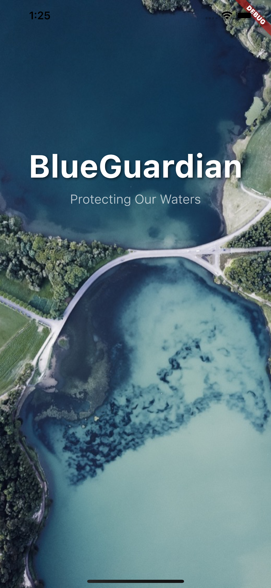
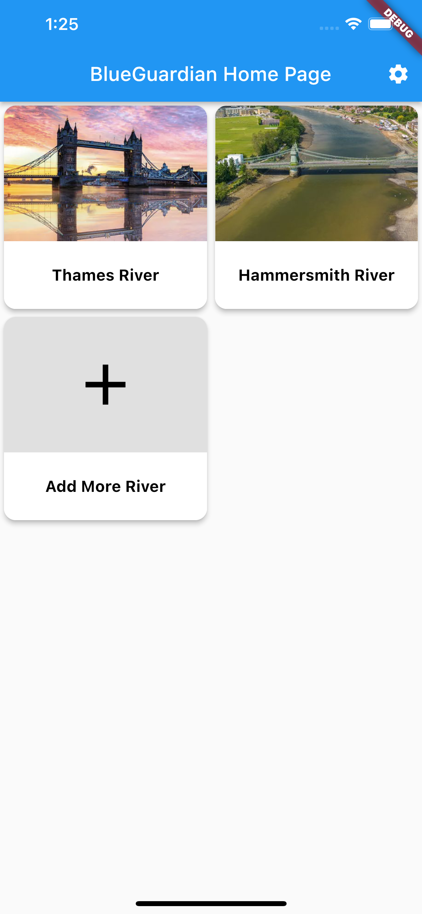
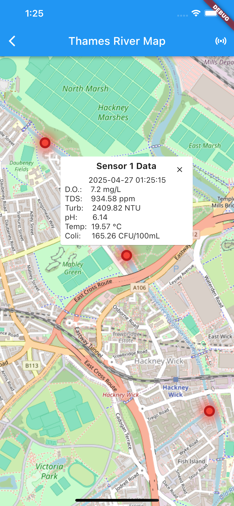
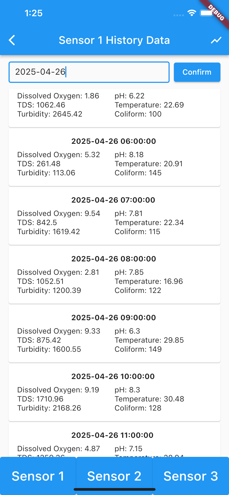
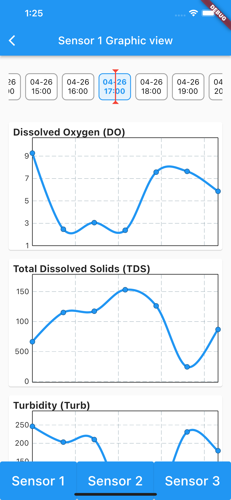
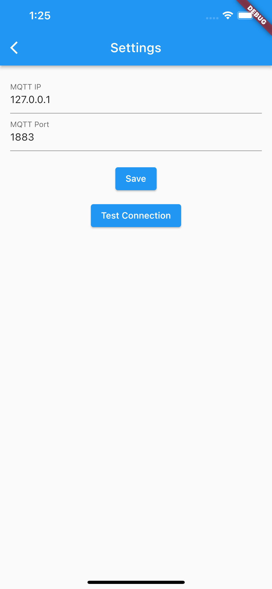

# REPLACE WITH YOUR APP NAME

This is the Final assessment template for CASA0014 - Please use this template and edit the relevant sections to personalise.
This section has a short introduction to what the application is

## Use this README File 

Use this section to show us what your Mobile App is about.   Include a Screenshot to the App, link to the various frameworks you've used. Include your presentation video here that shows off your Mobile App.   Emojis are also fun to include 📱 😄

Look at some other Flutter Apps online and see how they use there README File.  Good examples are:

- https://github.com/miickel/flutter_particle_clock
- https://github.com/Tarikul711/flutter-food-delivery-app-ui    
- https://github.com/mohak1283/Instagram-Clone


## Include A Section That Tells Developers How To Install The App

Include a section that gives intructions on how to install the app or run it in Flutter.  What versions of the plugins are you assuming?  Maybe define a licence

##  Contact Details

Having Contact Details is also good as it shows people how to get in contact with you if they'd like to contribute to the app. 

**Protecting Our Waters through IoT and Mobile Technologies**

---

## Overview

**BlueGuardian** is a Flutter-based mobile application designed to monitor and visualize river water quality in real-time using water sensors and server services. The app empowers users to interact with live environmental data, aiming to protect and improve our connected aquatic environments.

This project is part of the UCL CASA0015 Mobile Systems coursework, demonstrating comprehensive skills in mobile application development, IoT integration, cloud communication, and user-centered interaction design.

---

## Features

- **Interactive Splash Screen** with animations.
- **Multi-View Navigation**:
  - Home Grid (select rivers)
  - Real-time Map View (with dynamic sensor markers)
  - Sensor Data History List
  - Graphical Visualization over Time
  - MQTT Server Settings Page
- **Real-time MQTT Communication**:
  - Subscribe to sensor data topics.
  - Receive and decode water quality parameters.
- **Physical Device Interaction**:
  - Reads parameters like Dissolved Oxygen, TDS, Turbidity, pH, Temperature, and Coliform levels.
- **Historical Data Management**:
  - Request and visualize past water quality data.
  - Smooth time series browsing and graphs.
- **Cloud-Connected Architecture**:
  - Utilizes MQTT Broker for low-latency IoT communication.
- **User Customization**:
  - Change MQTT server IP and Port through app settings.

---

## Tech Stack

- **Frontend**: Flutter (Dart)
- **Backend Service**: MQTT Broker, SQL database
- **Libraries**:
  - `flutter_map` (Map display)
  - `fl_chart` (Line charts)
  - `mqtt_client` (MQTT protocol support)
  - `shared_preferences` (Persistent local storage)
  - `intl` (Date and Time formatting)

---

## Screenshots

| Splash Screen | Home Page | Map Screen |
|:---:|:---:|:---:|
|  |  |  |

| Sensor History | Graph View | Settings Page |
|:---:|:---:|:---:|
|  |  |  |


---

## Folder Structure

```
/lib
  |- main.dart               # App entry and navigation
  |- map_screen.dart         # Map view with live sensor markers
  |- sensor_screen.dart      # Historical sensor data list
  |- graph_screen.dart       # Sensor data charts
  |- settings_page.dart      # MQTT server settings
/assets
  |- Startpage.png
  |- Thames.png
  |- Hammersmith.png
  |- commingsoon.png
```

---

## Usage Instructions

1. Install dependencies:
   ```bash
   flutter pub get
   ```
2. Run on emulator or real device:
   ```bash
   flutter run
   ```
3. Configure MQTT server:
   - Open Settings page inside the app.
   - Enter your MQTT Broker IP and Port.
4. Start browsing river sensor data!

---

## MQTT Topics Used

| Topic         | Purpose                              |
|:--------------|:-------------------------------------|
| `AQ/send`     | Publish real-time sensor readings              |
| `AQ/request`  | Request historical sensor data       |
| `AQ/response` | Receive requested historical data    |

---

## Problem Statement

Many urban rivers are under-monitored despite rising pollution threats. Existing professional monitoring systems are expensive, complex, and inaccessible to local communities. **BlueGuardian** provides a low-cost, mobile-accessible system for real-time water quality tracking, aiming to foster community-driven environmental protection initiatives.

---

## Future Improvements

- Add user authentication and profile tracking.
- Enable sensor fault detection and alert mechanisms.
- Integrate weather APIs to correlate water quality with environmental conditions.
- Support offline data caching.

---

## Credits

- Developed by: Zhuohang(John) Wu
- For: CASA0015 - Mobile Systems 2024
- Supervisor: Steven Gray

---

## License

This project is open for academic purposes. Commercial reuse requires permission.

---

## Contact

For any queries, please email me [here](mailto:zhuohang2024@163.com).

---

## Video Demo

👉 [demo video](insert-link-here)

---

## Deployment

A live landing page is available at 👉 [GitHub Link](https://github.com/Headmaster218/BlueGuardian)

